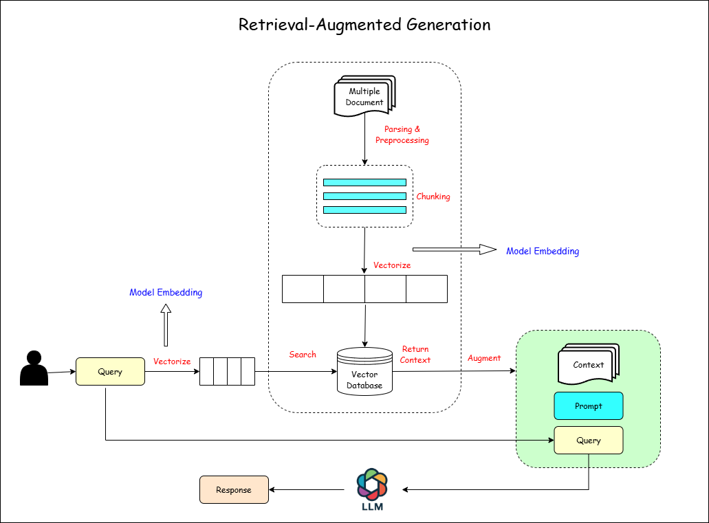

# RAG-LLM-for-Contextual-Answering

This project demonstrates how to use LangChain with Google Generative AI to process text data from a PDF document, generate embeddings, store them in a Chroma database, and answer user queries based on the content of the PDF.



## 1. Install Dependencies

To install the necessary dependencies, run the following command:

```bash
!pip install -U -q google-generativeai langchain langchain-google-genai langchain_community pypdf chromadb
```

### Dependencies:

- `google-generativeai`: To access and use Google Generative AI models.
- `langchain`: Framework for processing text and performing operations based on AI models.
- `langchain-google-genai`: For integrating Google Generative AI within LangChain.
- `chromadb`: Used to create a vector database for similarity-based searches.
- `pypdf`: For processing and reading PDF files.
- `nltk`: For text processing, such as splitting documents into smaller chunks.

## 2. Import Libraries

Next, import the required libraries in your notebook:

```python
from google.colab import userdata
from langchain_google_genai import ChatGoogleGenerativeAI
from langchain_text_splitters import NLTKTextSplitter
from langchain_google_genai import GoogleGenerativeAIEmbeddings
from langchain_community.vectorstores import Chroma
from IPython.display import Markdown as md
from langchain_community.document_loaders import PyPDFLoader

import nltk
nltk.download('punkt_tab')
```

## 3. Load and Process Text (PDF)

Download and load the PDF document. Split it into separate pages for processing.

```python
!curl -o /content/Faktor_Risiko_Dominan_Penyakit_Jantung_Koroner_di_Indonesia.pdf "URL"
loader = PyPDFLoader("/content/Faktor_Risiko_Dominan_Penyakit_Jantung_Koroner_di_Indonesia.pdf")
pages = loader.load_and_split()
md(pages[0].page_content)
```

## 4. Initialize the LLM Model

Set up the Google Generative AI model using the API key.

```python
api_key = userdata.get('API_KEY')
chat_model = ChatGoogleGenerativeAI(google_api_key=api_key, model='gemini-2.5-flash', temperature=0.9)
```

## 5. Chunking

Split the document into chunks using the NLTK text splitter.

```python
text_splitter = NLTKTextSplitter(chunk_size=1000, chunk_overlap=100)
chunks = text_splitter.split_documents(pages)
print(len(chunks))
chunks[0].page_content
```

## 6. Create Embedding for Each Chunk

Generate embeddings for the chunks of text using the Google Generative AI model.

```python
embedding_model = GoogleGenerativeAIEmbeddings(google_api_key=api_key, model="models/embedding-001")
```

## 7. Store and Connect Vector Database

Create and store a Chroma vector database for similarity-based searches.

```python
db = Chroma.from_documents(chunks, embedding_model, persist_directory='./chroma_db_')
db.persist()
db_connection = Chroma(persist_directory='./chroma_db_', embedding_function=embedding_model)
```

## 8. Create a Retriever

Set up the retriever for searching the vector database.

```python
retriever = db_connection.as_retriever(search_kwargs={'k': 50})
print(type(retriever))
```

## 9. Filter Search Results

Filter the search results by asking a question to the retriever.

```python
check_response = retriever.invoke('jelaskan apa saja faktor risiko dominan untuk penyakit jantung koroner di Indonesia?')
md(check_response[0].page_content)
```

## 10. Create Chat Template for Responses

Set up a chat prompt template for the AI model's responses.

```python
from langchain_core.messages import SystemMessage
from langchain_core.prompts import ChatPromptTemplate, HumanMessagePromptTemplate

chat_template = ChatPromptTemplate.from_messages([
    SystemMessage(content='Anda adalah AI pintar yang dapat menjawab pertanyaan sesuai konteks yang diberikan terkait penyakit jantung koroner di Indonesia.'),
    HumanMessagePromptTemplate.from_template('''jawab pertanyaan berikut berdasarkan konteks.
konteks: {context}
pertanyaan: {question}
jawaban: '''),
])
```

## 11. Output Parsing

Initialize the output parser to convert the model's output into a readable format.

```python
from langchain_core.output_parsers import StrOutputParser
output_parser = StrOutputParser()
```

## 12. Format and Display Answer

Create a function to format and display the documents and answers.

```python
def format_docs(docs):
    return "

".join(doc.page_content for doc in docs)

formatted_docs = format_docs(chunks)
md(formatted_docs)
```

## 13. RAG Pipeline

Combine all the steps into a Retrieval-Augmented Generation (RAG) pipeline.

```python
rag_chain = (
    {"context": retriever | format_docs, "question": RunnablePassthrough()}
    | chat_template
    | chat_model
    | output_parser
)
```

## 14. Answer User's Question

Prompt the user for a question and answer it using the RAG pipeline.

```python
question = input('Question: ')
response = rag_chain.invoke(question)
md(response)
```

## Conclusion

This notebook demonstrates how to integrate LangChain with Google Generative AI to process PDF documents, generate embeddings, and answer questions based on the document's content using a vector database and a generative AI model.
